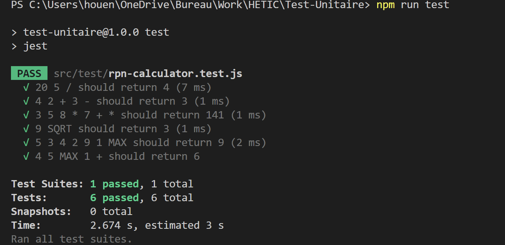

## Outils Utilisé

- **JEST** pour exécuté les test unitaire et de coverage

- NodeJS 20.10.0

- exécution des tests en ligne de commande:   npm run test

- exécution des tests avec coverage:  **npx jest --coverage**

## Résultat test unitaire

## Résultat test-coverage

